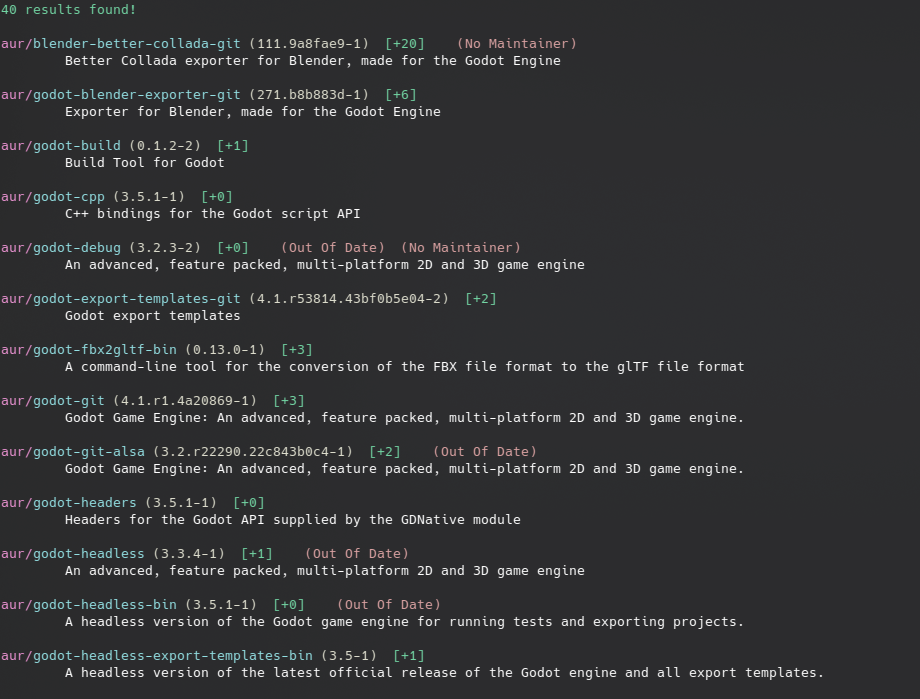

# Neko
The pretty and easy to use AUR searcher.

### Usage:
```bash
neko <package_name>
```

### Configuration:
Open the Config/Config.xml file in your favourite text editor!
- PkgLimit - int
- UseColour - bool
- ShowID - bool
- ShowVersion - bool
- ShowMaintainer - bool
- ShowVersion - bool

### Showcase:


### Installation:

Use the releases page.

#### Or Compile it yourself:

```bash
# Install rust using their official link
curl --proto '=https' --tlsv1.2 -sSf https://sh.rustup.rs | sh

git clone https://github.com/its-Lyn/neko.rs
cd neko.rs

cargo build --release
cp -r ./config ./target/release

cd ./target/release
./neko
```

### Add neko to your PATH.

```bash
# For fish users
# ~/.config/fish/config.fish
fish_add_path -m /path/to/neko.rs/executable_dir
```

```bash
# For bash users
# ~/.bashrc
export PATH="/path/to/neko.rs/executable_dir:$PATH"
```